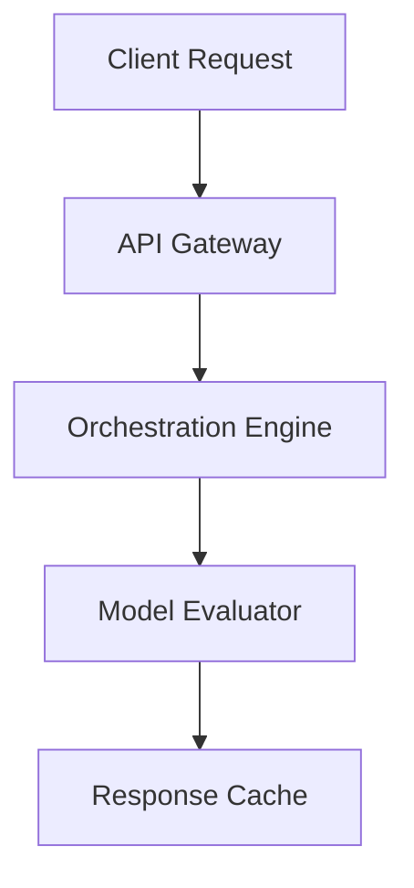

# Semantic Runtime Sdk

Next-generation semantic runtime sdk designed to streamline ai agents with minimal configuration.

[](https://opensource.org/licenses/MIT)
[](#tech-stack)
[](#contributing)

## Features
- **Support for multi-agent cooperative workflows and parallel tasks**
- **Dynamic prompt templating, state tracking, and long-term memory management**
- **Built-in state machine for execution tracking and recovery**
- **Cross-Platform**: Built on top of modern cross-platform technologies (Node.js 20+, TypeScript, Zod, Express.js).

## Tech Stack
- Node.js 20+
- TypeScript
- Zod
- Express.js

## Quick Start

```bash
# Clone the repository
git clone https://github.com/example/semantic-runtime-sdk.git

# Setup and run
npm install
npm run start
```

## Architecture Diagram (Mermaid)


## Contributing
We welcome contributions! Please open an issue or submit a pull request for any improvements.

## License
This project is licensed under the MIT License - see the LICENSE file for details.
